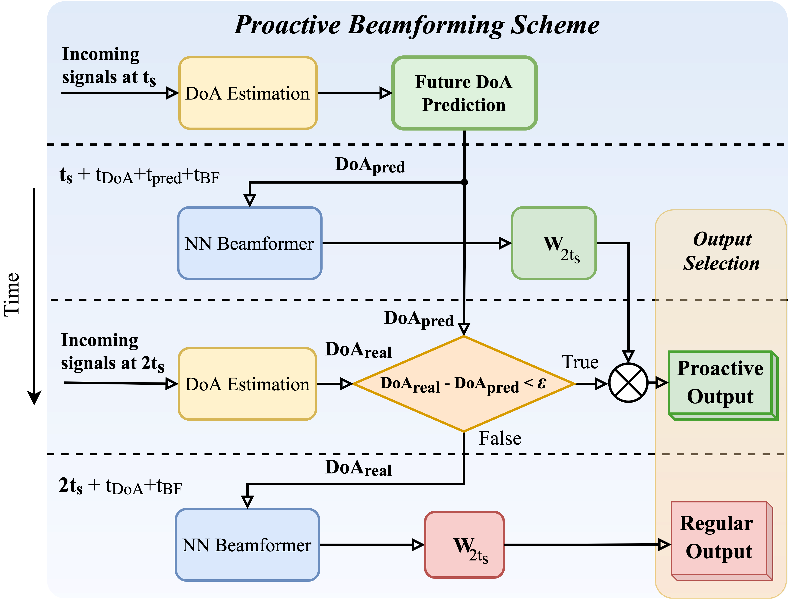
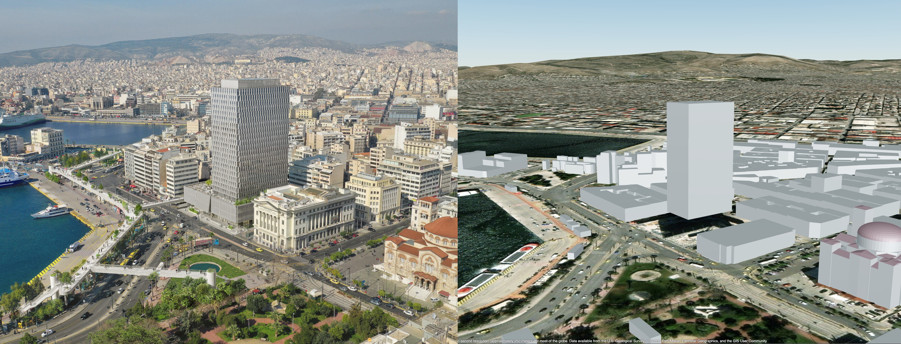
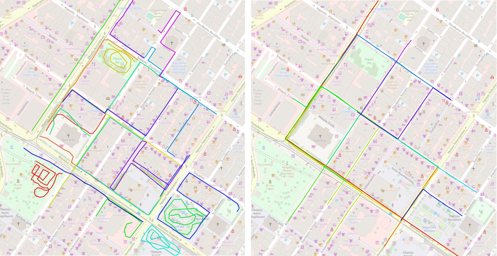
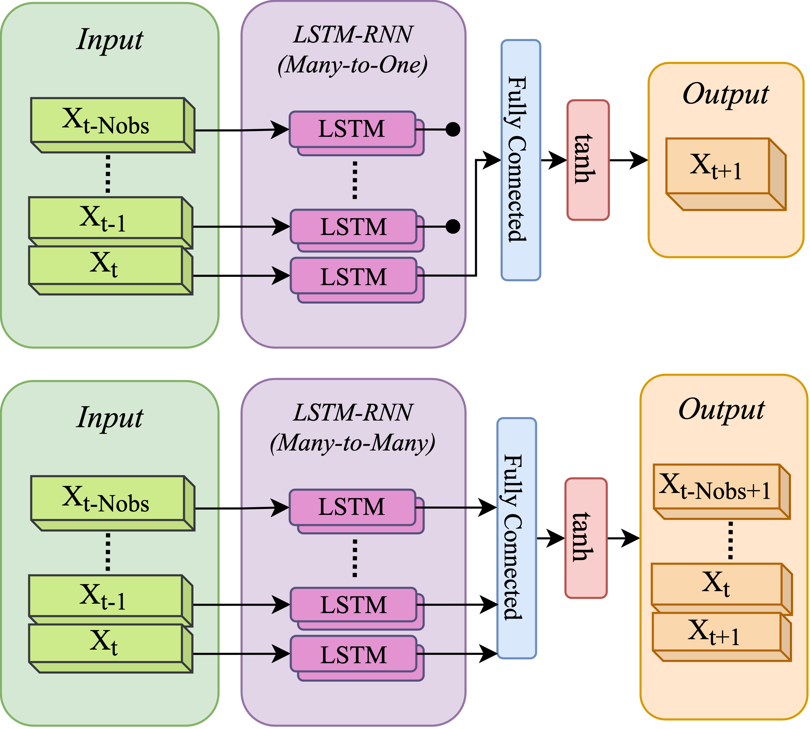

# Proactive 3D Beamforming with Transformers, RNNs, and Ray-Tracing in MATLAB

This repository accompanies the work presented in the paper:  
"A Novel Neural Network Approach to Proactive 3-D Beamforming" [IEEE Xplore](https://ieeexplore.ieee.org/document/10750053).

## Synopsis

This study focuses on a novel proactive beamforming scheme at millimeter-wave frequencies using Transformer Neural Networks (TNNs), Long Short-Term Memory (LSTM) networks, and Gated Recurrent Units (GRUs). The proposed methodology predicts future Directions of Arrival (DoAs) of signals, enabling the system to preemptively adjust beamforming weights, thereby reducing latency in dynamic urban environments. Key aspects include:

- **Simulation Environment**: An urban environment is simulated using OpenStreetMap (OSM) data to create realistic movement paths.
- **Dataset Generation**: Comprehensive datasets of pedestrian and vehicle movement paths were created to train and evaluate the proposed models.
- **Proactive Beamforming**: The models are trained to predict future DoAs, enabling real-time beamforming adjustments.

## Methodology Overview

The process of proactive beamforming is divided into three primary stages, each corresponding to a subfolder in this repository:

### 1. Dataset Generation (`step1_dataset_generation`)

- **Purpose**: Simulate realistic movement paths and generate DoA trajectories using ray-tracing techniques.
- **Input Files**:
  - **OSM Map File (`peiraias.osm`)**: Provides geographic data for simulation and visualization.
  - **Predefined Track File (`peiraias_pedestrian_tracks.txt`)**: Contains GPS tracks generated with `gpsvisualizer.com` and processed by `readGpsTracks()`.
- **Procedure**:
  - Import OSM data and predefined tracks.
  - Generate movement paths for pedestrians and vehicles.
  - Create DoA trajectories using ray-tracing propagation models.

### 2. Training Neural Networks (`step2_training_nn`)

- **Purpose**: Train Transformer, LSTM, and GRU models to predict future DoAs.
- **Key Models**:
  - **Transformer Neural Network (TNN)**
  - **LSTM-Based Recurrent Neural Networks**
  - **GRU-Based Recurrent Neural Networks**
- **Procedure**:
  - Prepare input data sequences and labels.
  - Train models using supervised learning techniques.
  - Evaluate models based on prediction accuracy and response time.

### Placeholder for Figure 2: Neural Network Model Architectures

### 3. Evaluating the Proactive Scheme (`step3_evaluation`)

- **Purpose**: Assess the performance of the proactive beamforming scheme.
- **Evaluation Metrics**:
  - Prediction accuracy of future DoAs.
  - Response time and computational efficiency.
  - Real-time beamforming adjustments using predicted DoAs.
- **Procedure**:
  - Test models on unseen data.
  - Compare performance with baseline algorithms (e.g., Kalman Filters).
  - Analyze statistical metrics and visualize results.

## Additional Information

### Input File Details

#### OSM Map File (`peiraias.osm`)
This file is used to provide geographic context for the simulation environment. It must be placed in the appropriate folder as indicated in the scripts.

#### Predefined Track File (`peiraias_pedestrian_tracks.txt`)
This file contains GPS tracks formatted as:
