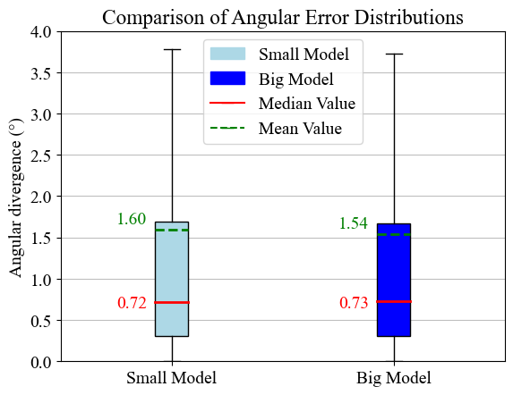

# Training Transformers and RNNs to forecast future DoAs

*This repository accompanies the work presented in the paper:  
"A Novel Neural Network Approach to Proactive 3-D Beamforming" [IEEE Xplore](https://ieeexplore.ieee.org/document/10750053).*


Using the dataset with DoA trajectories created in step 1, we intend to train and evaluate different types of neural networks (NNs) for the task in hand. 
- `train_model.py` is the main script that performs all necessary steps described below.

- `transformer_utils.py` contains the class definitions of different transformer (encoder-only) models that were tested
for this task. Finally, the model `contextDOAEncoder4` was used as the proposed architecture.

- `utility_functions.py` contains various important functions for data manipulation, plotting, and more that are used throughout
this script.

### Optional: 
Since the proposed model for proactive beamforming is the transformer architecture, the LSTM and GRU training is optional
but both the hyperparameter tuning and training scripts can be accessed under the `Bayesian Optimization Tuning` and `LSTM and GRU Training` directories 
accordingly.

### Step 1: Data preparation
At this step, we inut the dataset with DoA trajectories containing the angles, angular velocities and angular
accelerations for each timestep. We then normalize the data based on their minimum and maximum values recorded
during the data collection process.

The normalization followed, is a bit unconvetional in the sense that we derive the min and max values from the dataset and
not by explicitly setting them for each input value. This is because the application is location-based and the angular 
sectors covered at each scenario may be different from the full [-90, 90] degrees of the operational range of the base
station. The DoA trajectories in the dataset cover a plethora of possible incoming signal directions, 
based on the predefined paths and the coverage map of the base station. Thus, by limiting the normalization sector
closer to the range of the recorded DoAs, we utilize the normalization sector better which improves training performance.

### Step 2: Configuring the NN designs
- For the transformer architecture, we opted to test two variations, a big model and a small model. You can modify the size of the model in the following part:

```python
# Big model design
#d_model = 512
#context_dim = d_model
#nhead = 8
#num_encoder_layers = 4

# Small model design
d_model = 256
context_dim = d_model
nhead = 4
num_encoder_layers = 2
```

- To configure the RNN model hyperparameters (number of layers, size per layer), we performed hyperparameter optimization using bayesian optimization. 
The results are presented in the paper. 

The scripts for the Bayesian Optimization of the LSTMs and GRUs (many-to-one and many-to-many) can be found in the `Bayesian Optimization Tuning` directory.
### Step 3: Training and evaluating the NNs
After training the model with `train_model.py`, we move on to the juputer notebook `evaluate_model.ipynb`. The script 
imports pre-trained models (big and small variation of the transformer NN) and calculates the mean angular distance between the 'real' and 'predicted' DoAs of future
timesteps of trajectories included in the test dataset. These pre-trained models are stored in the `\RESULTS` directory, so make sure to change the path to the pre-trained models
according to your local directory:

```python
model_path = 'RESULTS/model_checkpoint_small_v1.pth'
```



